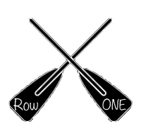

# RowONE

*RowONE* is a company based in the coasts of the United States, renting a water sport recreational equipment at a lower cost. Our business provides customers more opportunities to enjoy aquatic sports by being engaged in buying, housing, maintaining, and transporting goods on behalf of the customers.

## Assignment 1

Team Leader - Joe Gomez

### **Customer Segment**

Our target customers are anyone from the age of 18 and up (for legal reasons), who live an active lifestyle or intend to make healthier choices. We target all income levels: the lower class, who might not be able to afford purchasing surfboards, wakeboards, paddle boards, canoes, or kayaks, this provides them with the opportunity to pursue multiple extracurricular activities at a reasonable cost. For the middle to high class, they just might not feel like owning, housing, maintaining and transporting their own equipment, so this provides them the opportunity to enjoy these activities without all of the responsibilities. 

We are specifically and solely specialized in the outdoor fitness and aquatic sports market. There are many people who exercise, compete in water sports, and those who just want to take something out on the water for relaxation and leisure.  Additionally, the surfing business will grow within a few years because surfing has become an Olympic sport for Tokyo2020.  We expect more people to visit the US to go surfing, and our project will be a great business opportunity.

Our customers will be primarily based near the water. Our most successful locations will be by popular local lakes, rivers and oceans. This means that most of our customer base will be located on the coasts of the United States. There will be opportunity to branch into camping sites that sit on rivers and lakes to support another section of consumers. With both coastal and landlocked locations we will offer a service almost everywhere in the U.S..

### **Value Propositions**

This is an entirely new service that customers previously didn’t know they wanted or needed, because it wasn’t available. There is no similar offering.  We are allowing customers access to our surfboards, wakeboards, paddleboards, kayaks, and canoes on the waterfront.  This gets rid of the need to buy, house, maintain, and transport their own aquatic gear.  It allows them to save time and money. It dramatically increases our customer's accessibility to aquatic recreational equipment, with the added convenience of being right on the waterfront, and it is easy to rent.

### Overview of Business

We are the first, and only, water sport recreational equipment rental business. We are revolutionizing the way people rent water sports equipment. We are an online business that offers the equipment at the waterfront of most beaches, lakes, and rivers.  If we don’t have a kiosk/rack/locker at the waterfront you’re going to, let us know and we’ll transport the equipment to your location, or your destination.  We offer a smartphone app so you can easily locate our kiosks/racks/lockers and make sure the equipment is available. We believe our customers deserve a convenient, easy, and hassle-free way to have fun. However there are also ramifications for the damage of our equipment, which we follow/track by account information and the serial numbers of the equipment rented that we assign to each customer based off of the account.

Our initial line of products and service include surfboards, wakeboards, paddleboards, kayaks, and canoes. These are readily available and accessible from the waterfront, which are in electronic kiosks/racks/lockers. They will be able to select the piece of equipment they want to rent from their phones, or the screens on the kiosks, and purchase the rental. It will then be dispensed. A customer will be charged by the half hour.  We will have employees that provide the upkeep and maintenance of an item.
Within the next 5 years, our business is expected to grow in terms of the amount of kiosks/racks/lockers around the nation, and how much equipment they hold.

## Assignment 2

Team Leader - Chase Pederson

### **Channels**

#### *Marketing* 

Raise awareness through advertisements, online, and on waterfront.
Less focus on television ads as our consumers likely don’t watch a lot of TV.
Using Social Networking Services (SNS)(i.e. facebook, twitter, instagram) to advertise our business because we target young customers, and SNS is free.
Build relationships with local sporting goods businesses, so they can also recommend or let their customers know about our services. Using sponsorships with high profile celebrities and role models will also help us expand on spreading information, especially with athletes well known in the water sports industry.

#### *Rating System*

In app/on website ability to rate products to show quality.
Its rating is made public so that customers can see rates and comments (like the situation we buy product online in Amazon) 
Point of Purchase
In app, on website to provide easily accessible, and in person at rental machines.
Handle with many languages (spanish, chinese, franch, etc.) because we target people from all over the world - using technology to translate English into other languages.
 
#### *Deliver value*

Customers can see the stock of paddleboards, kayaks and canoes in app/on website
Refer-a-friend program: Tell a friend about our business (recommend to try) and the person who introduces to the friend can get coupon, or special bundle rentals, for example rent up to four kayaks at full price and get an extra rental for free for duration of original rental. Rewards program, for loyal customers who rent from us more frequently than others, allows people to earn rewards such as souvenirs (ie stickers, koozies, t-shirts etc), or discounts on future rentals.

#### *Customer Support*

 Contact Us system with email, text support, and 24/7 bot system to help with issues with technology
 
 
### **Customer Relationships**

#### *Type of Relationship*

We maintain a short-term to long-term relationship with our customers.

#### *Usage of said relationship*

Short-term: This is for those who are using our services as a temporary means to partake in the activities on the water. This is temporary because they either plan on rarely partaking in the activities, or they eventually plan to buy their own equipment in the future.

Long-term: This is for our customers who do not want to and/or cannot afford, house, or take care of their own equipment. We offer an easy alternative to those who want to partake in the water activities, but who may not be able to maintain ownership of their own equipment.

#### *Direct Personal assistance*

There will be online customer support for anyone who is having troubles, but there will also be buildings in select areas that will be able to assist on-site. If there is not a building in that area and the issue cannot be resolved through customer support (or the patron wants to speak in person), then we will send a technician in the local area to assist.

## Assingment 3

Team Leader - Erina Funatsu

### **Key Activities**

#### *Platform for customers to use (App and website)*

Our business will develop applications for smartphone users and establish an Internet website so that customers can borrow equipment for water sport activities - surfboards, wakeboards, paddle boards, canoes, or kayaks. In both the app and website, customers can search what they want to rent by putting a few words in the search box, and they are able to quickly pick up equipment from the categories (i.e. surfboards, wakeboards, paddle boards, canoes, or kayaks). They can also check rates and comments before deciding to borrow products. We also have a wide variety of different brands per sporting equipment, so preference is definitely encouraged for our more selective customers. We value their opinion and want to provide them with the best of the best. 

In the smartphone app, there is a notification function telling customers valuable information such as discount, sale, invents, etc. Our business creates value by providing much cheaper water sports equipment for users who are not able to afford other products. These services contribute to solving customer problems because customers can compare the cost, condition, experience with the seller of equipment in the app or web. This means they can choose the products that meet their needs. All customers need to enroll their email before using services as it helps us maintain customer relationships too. Creating an account in our online website will further help us assist our customers because our online website saves past rentals and recommend other equipment for faster rentals. For people who are new to the water sports industry, we also provide online information and physical pamphlets that give a brief breakdown of how to use and take proper care of our equipment so it can be used to the max potential and returned in the condition it was rented.

### **Key Resources**

* *Physical - goods, stores, computer, server, network
* *Intellectual - customer database, logos, website, apps, partnership
* *Human - engineers/technical experts, business partners
* *Financial - cash, credit, stock 

#### *Business partners*

Our business includes providing products to users, delivering them to users, and carrying out maintenance of products. We do not either produce the water sport equipment , deliver them, or maintain them; instead, we manage these as a series of business procedures. We cooperate with companies for manufacturing, delivering, and maintaining these products. If users try to go through these processes by themselves, it is very difficult and expensive for them. Our business acts as a mediator between each sector. Our connections build a bridge between producing the product, delivering it, and keeping up that maintenance of said product. We act as a middleman for each section, and this ensures that we can handle the leasing prices for customers. This business model not only helps users to get equipment as cheap as possible, but also have benefits for our business partners. We are not only giving customers a brief sample of our business partners’ products, we are also advertising to increase their sales as well, so it is beneficial for both sides in the event our consumers wish to purchase their own equipment. Since we are developing and maintaining the app and website that collect customers’ comments or rates towards a product, we share those valuable information with business partners. As a result, business partners can also make a profit by providing products or services that are specifically tailored to the user’s needs. We are in a win-win situation.

#### *Assets*

Providing a cheaper and more accessible way to rent water equipment is a major part of our business, we will be working with many businesses directly to cut down the costs. Our business partners play a major role in our company by providing their products or delivering the products from our facilities to the consumer’s location. The products will be acquired through business deals, and we will be renting them to consumers. We will need people to operate and fix any technical difficulties with our app and website since we are mainly an online company. Although we are primarily online-based, we also have on-site locations in popular spots. This is to more easily maintain and and out equipment rather than delivering it.

#### *Technology*

Our company will need a server to house our customer’s data and purchases. This also means that we need a network of computers at our facilities. These computers will have app and website development tools as well as tools to handle the customer’s data.

